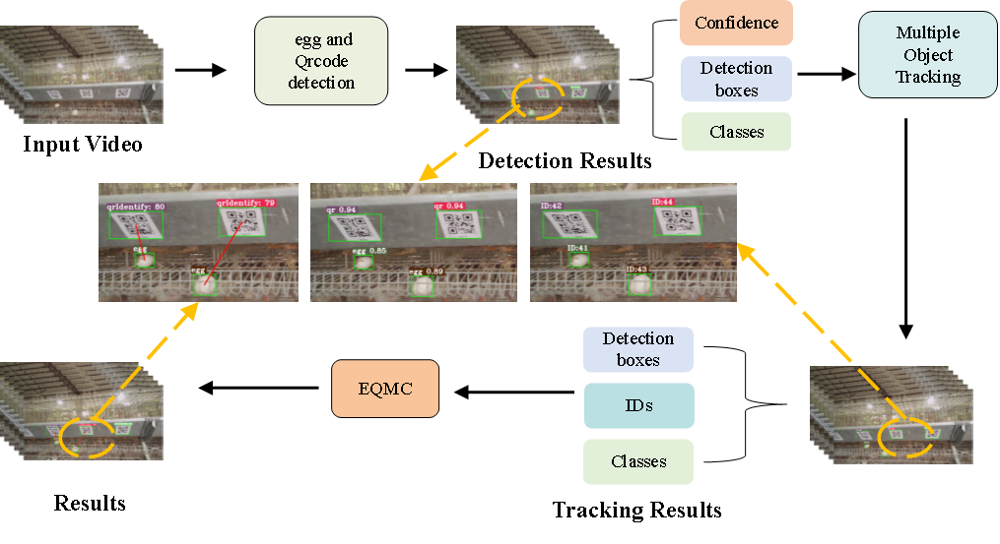
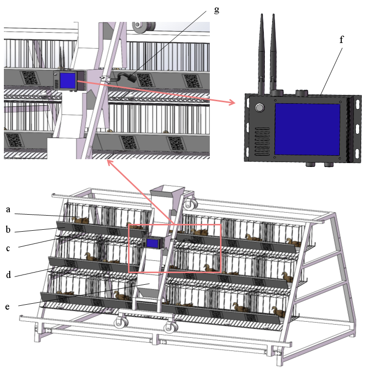
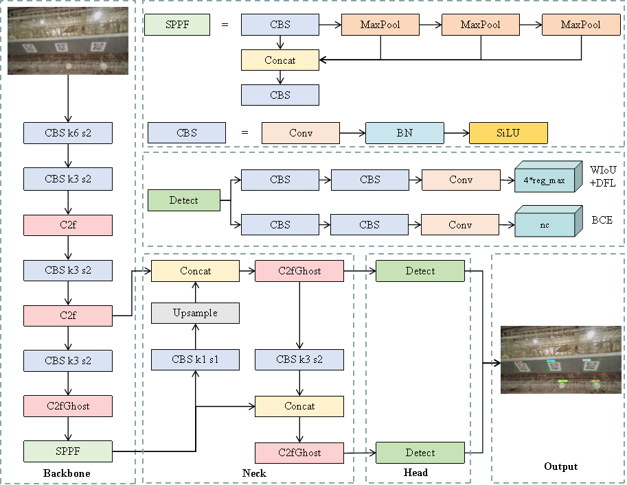
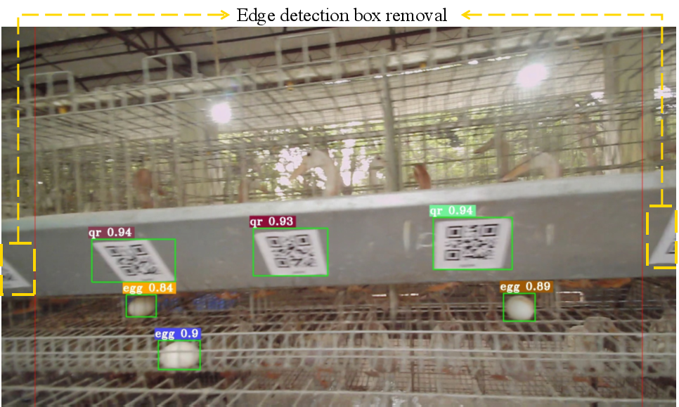
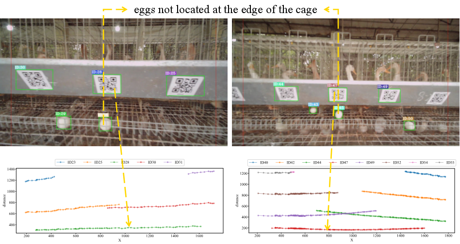
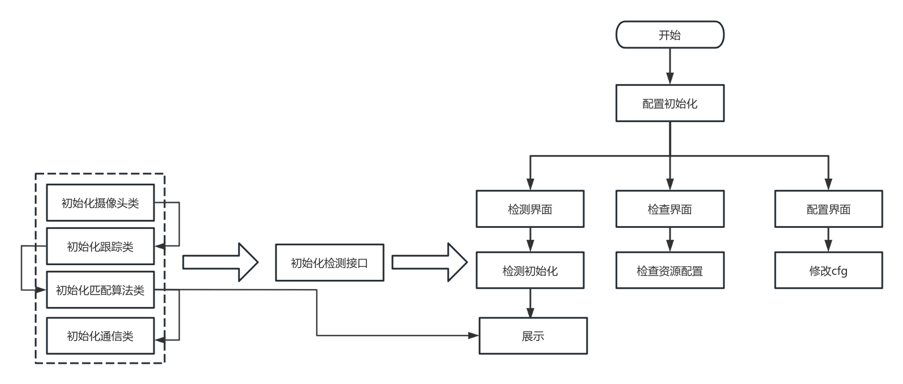
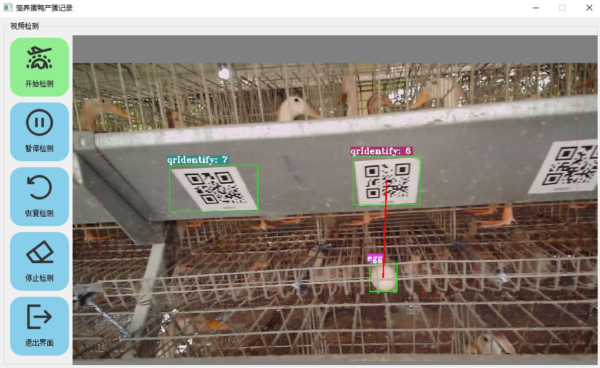

# duck_egg_record

#### 介绍
蛋鸭个体测产蛋记录程序

#### 软件架构
##### 1、算法架构说明
基于YOLOv8实现目标检测，OC-SORT实现目标跟踪,EQMC实现分笼匹配

###### 部署示例

###### 网络模型

###### 跟踪模型

###### 去除编译

###### 距离计算

##### 2、程序架构说明
```
├─configs  //配置文件
├─docs  // 文档说明文件与实例图
├─model
│  ├─communication  // 通信模块
│  ├─match  // EQMC算法实现
│  ├─track  // 基于YOLOv8与OC-SORT实现目标跟踪
├─output  // 临时文件
├─resources  // 存放资源文件，包括QT界面资源，二维码识别库，目标检测模型文件
│  └─wechat
└─views // QT界面
    ├─Label  // QT界面Label
    ├─utils  // 兼容资源
```
程序算法执行采用多线程设计，通过共享队列实现算法的通信，提供算法执行速度。

##### 3、程序效果

#### 安装教程

1.  pip install -r requirements.txt

#### 使用说明

1.  python app.py